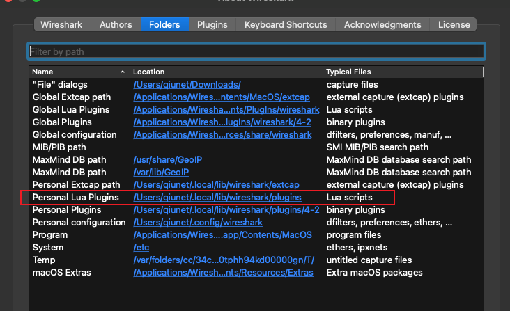
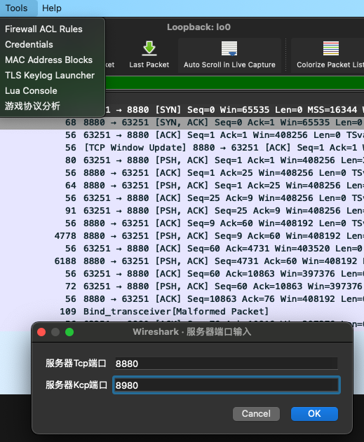
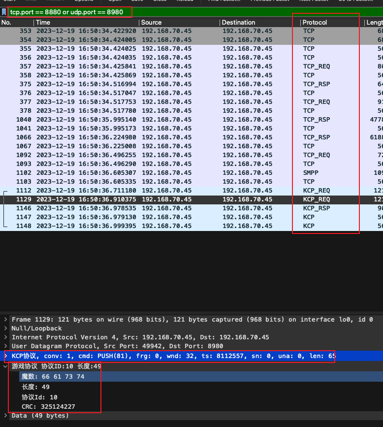

# Wireshark 插件

### 环境
	version: wireshark 4.2
	os: macos

###  第一步
找到 `wireshark` 的`about`, 在子目录里面找到`folder`.
找到如图的Lua 目录. 将lua脚本放到目录下, 然后重启!

### 第二步

点击Tools下的游戏协议分析.在弹出的窗口输入各自的端口. 点击ok

### 最后

> 脚本会自动应用对应的filter. 然后修改Protocol列.
> 
> Req表示客户端的请求, Rsp表示服务器的响应.
> 
> 在协议内容详情里面会显示对应的Kcp头内容以及游戏协议头内容.
