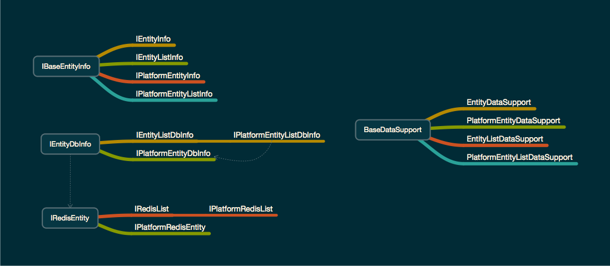

# QiunetDatas

### Redis Entity
     

### 测试
    因为测试需要数据库, 所以需要先导入sql/test.sql 到数据库测试使用
    jdbc.properties 和 TestLog4jJdbc 需要修改对应的账号密码信息.
    然后执行 `mvn test`

### 名词
* `dbIndex` 	分库的索引
* `dbName`    库的名字, 因为多个库公用一个连接池. 所以需要库名区分.
* `dbInfoKey` 能够决定分库的字段或者DbIndex
* `dbSourceKey` 能够决定使用哪个数据库连接池, 通常为 0 ~ 99 的数字.在db.properties 里面配置

### 结构
    分为几个部分
    DataSupport 衍生4个类可以与开发基本一一对应
    IBaseEntityInfo 类的信息. 为DataSupport的构造时候使用. 4个接口在开发中一一对应
    IEntityDbInfo 和数据库交互的都是该接口直接或者间接实现类
    IRedisEntity  和redis相关的都是该接口直接或者间接实现类 已经实现了4个通用的类.  在(org.qiunet.data.redis.support)包下
    

### Mysql
	使用db.properties 配置.
	uid_db_length uid 使用几位表示. 一般两位. 可以最大表示100个库.
	login_need_db     login 的数据分布在几个库. 一般是${db_max_count}个库. 
	db_max_count 	  有多少库用来作为分库使用.100完全足够.
	db_name_prefix 	   如果100库的话,库名为: prefix_(0~99) 
	db_size_per_instance 	一个数据库实例有多少数据库 用来判断并且公用一个配置源.
	
	datasource_global_name 一般会有个不需要分库的数据库. 比如后台的账户信息等.
	
	数据库的源id
	db_max_count % db_size_per_instance == 0的.
	比如: 100个库. 一个实例20个库: 则 0 20 40 60 80 共5个源id
	配置数据库的源:
	database.${源id).${连接池参数}=${val}
	
	例如:
	   # player_0 db
       database.0.driverClassName=com.mysql.jdbc.Driver
       database.0.url=jdbc:mysql://localhost:3306/test_0?useUnicode=true&characterEncoding=utf-8&useSSL=false
       database.0.username=root
       database.0.password=qiuyang
       
       database.global.driverClassName=com.mysql.jdbc.Driver
       database.global.url=jdbc:mysql://localhost:3306/test_global?useUnicode=true&characterEncoding=utf-8&useSSL=false
       database.global.username=root
       database.global.password=qiuyang

### DataSupport
	所有的Mysql操作都是通过DatabaseSupport 来的. 它是一个单例模式. insert detele select
	以及update 都需要带上能标识源的一个字符串(由Dbproperties.getDataSourceTypeByDbIndex方法得到). 	
	
	
### Redis
     redis 主要是AbstractRedis. 支持自定义JedisPool 或者 从一个IkeyValData 里面读取.
     一般设定在db.properties.
     
     db.properties 参数配置:
     redis.${redis名称}.${连接池参数}=${val}  // 注: host pass port 不是参数. 是jedis配置. 
     
     例如:
		 redis.data.host=localhost
		 redis.data.port=6379
		 redis.data.pass=
		 redis.data.timeout=3000

### 思路
	所有的对数据的操作都叫 DataSupport.
	下面分:
		EntityDataSupport 			// 单个对象的操作
		EntityListDataSupport 			// list对象的操作  
	
	特点:	
	1. 通用的. 就是4个基本支持现有的开发数据模型.
	2. 能够支持 异步更新到数据库. 
	3. 自动更新redis . 
	4. 能够利用本地线程变量无线支持单线程获取.
	
	但是每个数据模型不同点怎么办? 
		使用的是 IEntityInfo 来区分的. 每个模块的不同点使用info对象来提供.

### 自动生成Po Mybatis xml等[ProjectInit](../ProjectInit/README.md)
	因为大量的事情是重复的, 所以使用velocity生成代码. 
	避免人的疏忽带来的错误.

### 自动根据Po的字段同步数据库的表(create drop alter 等)
	默认所有的分库中的表结构都是一样的.只要同步字段,就同时操作所有的库.
	
