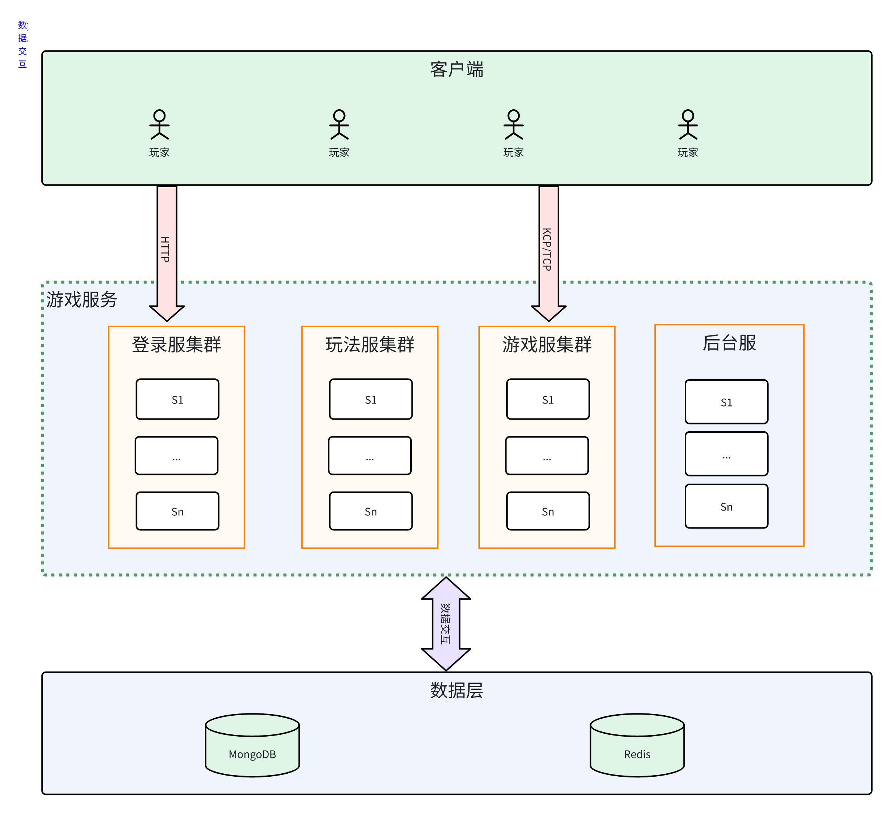

# DuoDuo
    自己根据过往开发的经验. 自己抽出来的一套公用代码.
    代码规避了很多可能在开发出现中的坑点. 然后尽量弱化了配置需求. 
    会在使用的过程慢慢完善成为一套可以做游戏和App开发的工具模块汇总.
    
    Duoduo的原则是 理解后,融入自己的代码中. 所以有问题时候,
    能够在第一时间反应过来问题出在哪.

## Git配置
 - 不对换行符做自动转换 
`git config --global core.autocrlf input`

## 名词解释
* Do Data Object 持久化对象(阿里规范) 负责跟数据库交互的对象
* Bo Business Object 业务对象(阿里规范), 给业务提供支持的对象
* DataSupport 操作数据的类, 会自动搞定异步更新等问题
* Service    处理业务的一些公用方法
* Handler   处理请求的逻辑类. 一个请求一个handler
* TestCase  对应handler的测试类 

## 模块简介

| 模块名                                 | 简介                                                     |
| -------------------------------------- | -------------------------------------------------------- |
| [Quartz](Quartz/README.md)             | 定时调度相关的模块                                       |
| [CfgReader](CfgReader/README.md)       | 配置文件读取的模块                                       |
| [Cross](Cross/README.md)       		 | 跨服务交互相关的模块                                       |
| [QiunetUtils](QiunetUtils/README.md)   | 各种基本工具类                                           |
| [QiunetDatas](QiunetDatas/README.md)   | Mysql和Redis以及本地Cache使用模块, 实现了异步更新等功能. |
| [Entity2Table](Entity2Table/README.md) | 根据Do对象自动生成和更新数据库结构的模块                 |
| [ProjectInit](ProjectInit/README.md)   | 通过xml配置.自动生成Do Bo xml Service和调用的类          |
| [Excel2Cfgs](Excel2Cfgs/README.md)     | 已经废弃, 使用[DTools](https://github.com/qiunet/DTools)              |
| [FlashHandler](FlashHandler/README.md) | 能启动Tcp Http WebSocket作为服务的模块                   |
| [Function](Function/README.md)         | 部分业务中通用代码, 抽象出来做成的模块                   |
| [GameTest](GameTest/README.md)         | 模拟机器人测试的模块                                     |
| [JavaAgent](JavaAgent/README.md)       | 可以通过javaAgent 最后热加载指定的class                  |
| [LogRecord](LogRecord/README.md)         | 日志记录模块                                             |
| [all](all/README.md)                   | 打包成一个duoduo-all 方便调用的模块.                     |

## 服务器结构

​	

	思路:
	 1. 玩家会在Redis有一份简要数据
     
     2. 玩家登陆进去路由服, 路由服从GlobalDB判断是否有注册过. 
    	有直接返回对应的ServerId.没有根据服务器的情况, 分配一个Server.
     
     3. 排行榜玩法服数据存Redis, 不落地DB!
     
     4. 玩家需要进入某个玩法, 由路由服根据类型进行分配
     
     5. PlayerId 由3部分组成. 自增ID+ServerId+ServerId(位数)
    	例如: 12112 自增id为12  服务id = 11 serverId位数=2
    
     6. 每个服务启动时候, 注册状态到Redis. 并且定时更新(ServerId 最后更新时间 服务器在线人数等)

## 安装环境

* jdk 1.8
* maven 3.5
* Mysql(MariaDB) Redis 两个必须都有.
* 推荐使用 IntelliJ IDEA(Eclipse 对module的使用感觉不是很好).

## install
> 根目录执行 `mvn install -DskipTests`  
> 如果本地有测试环境. 可以不加: ` -DskipTests`  
可以直接打包到本地. 然后在maven引用.

## 引用
	<dependency>
		<groupId>io.github.qiunet</groupId>
		<artifactId>duoduo-all</artifactId>
		<version>${version}</version>
	</dependency>

## 示例
自己写了服务器端模板工程. 可以参考[模板项目](https://github.com/qiunet/DuoDuoTemplate)

## 交流
QQ群: `669409114` , 入群请附带申请留言: "Github"
